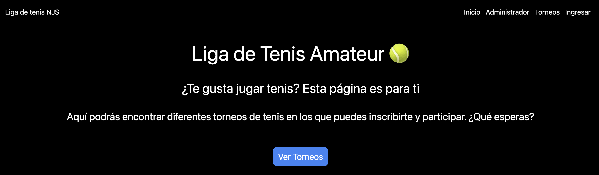
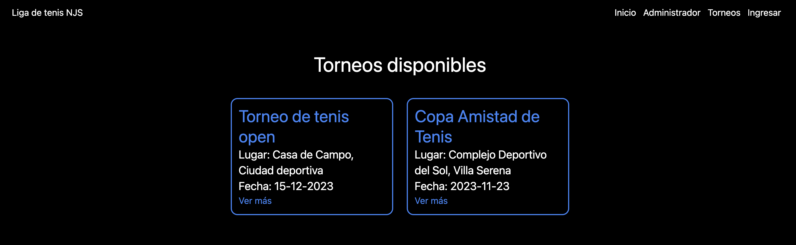
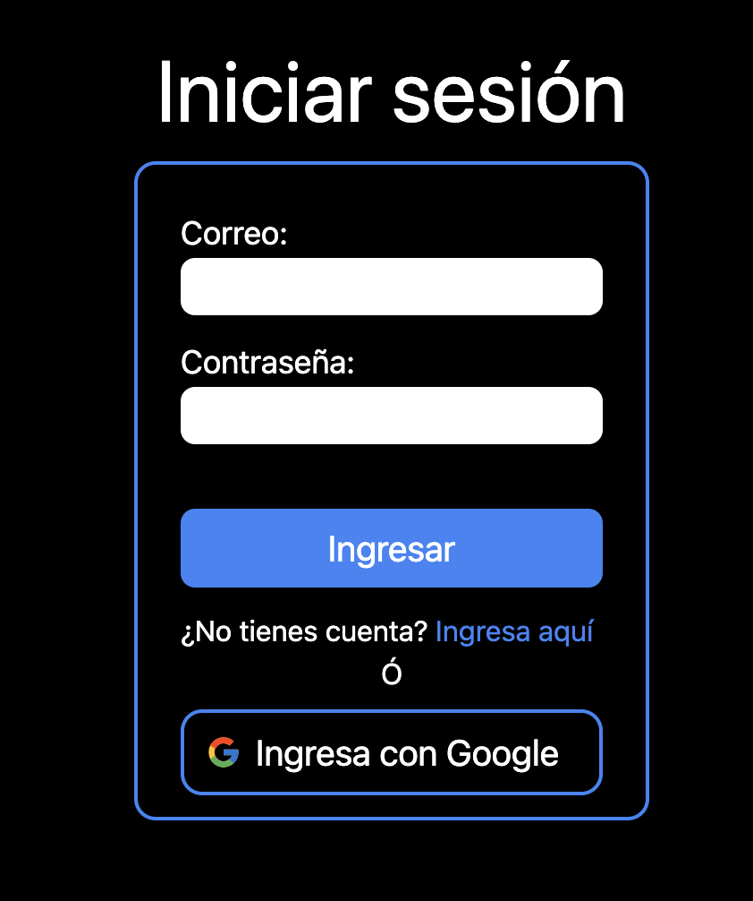
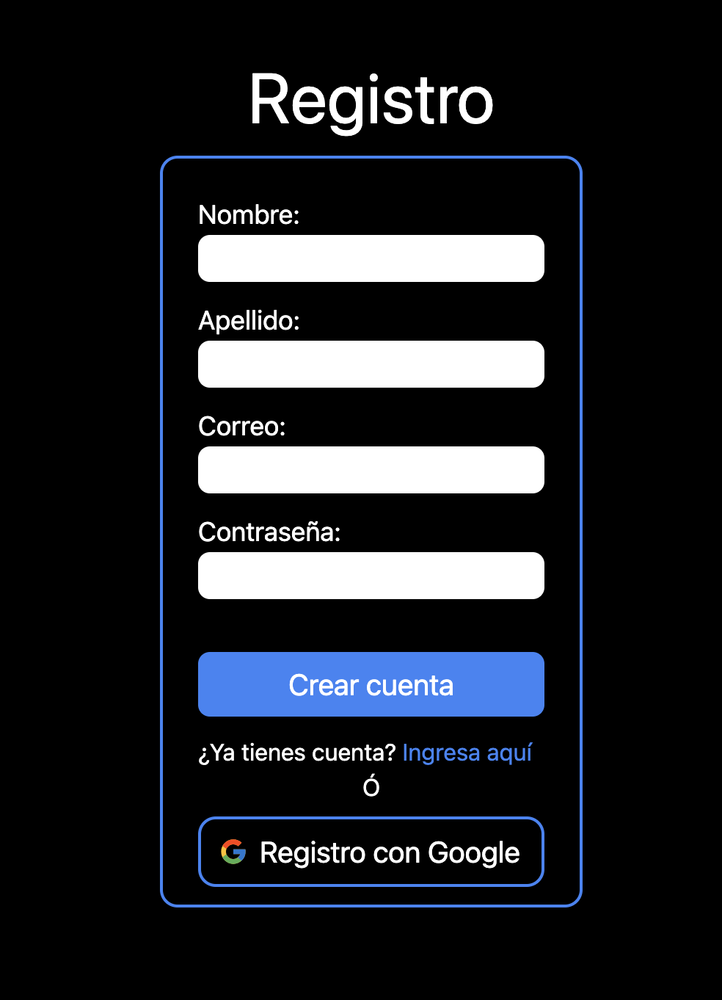
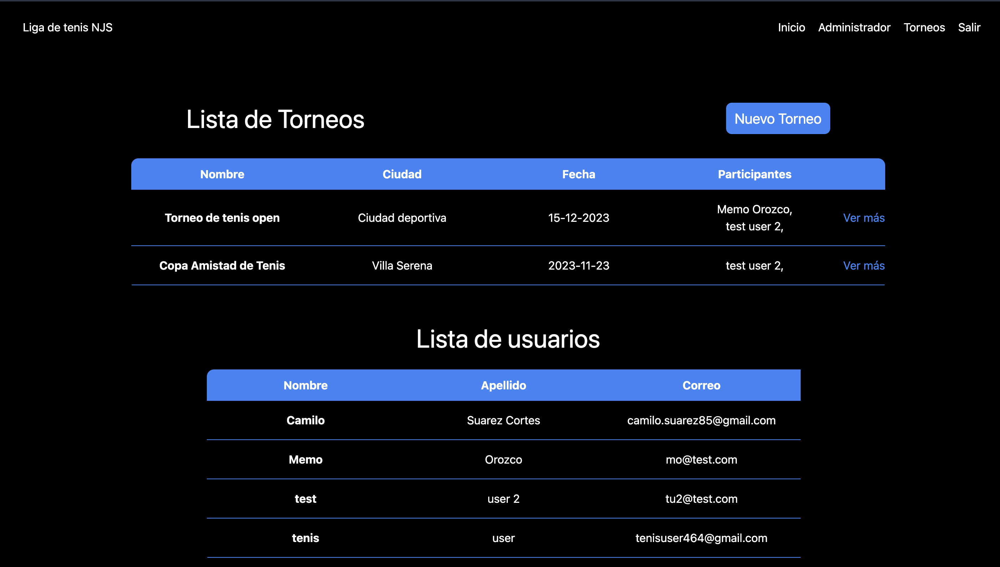
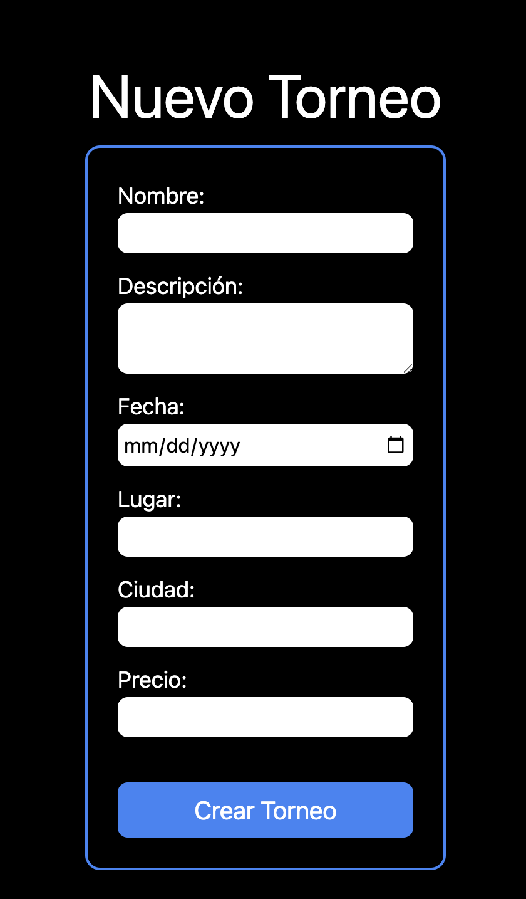
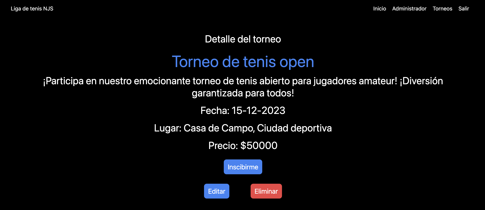
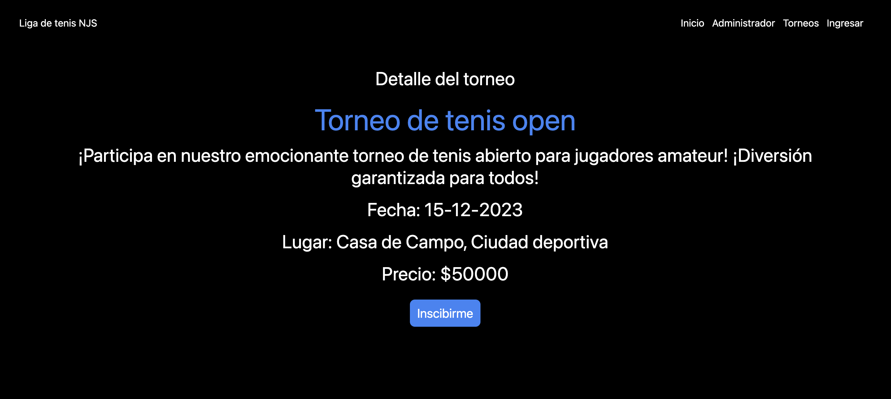
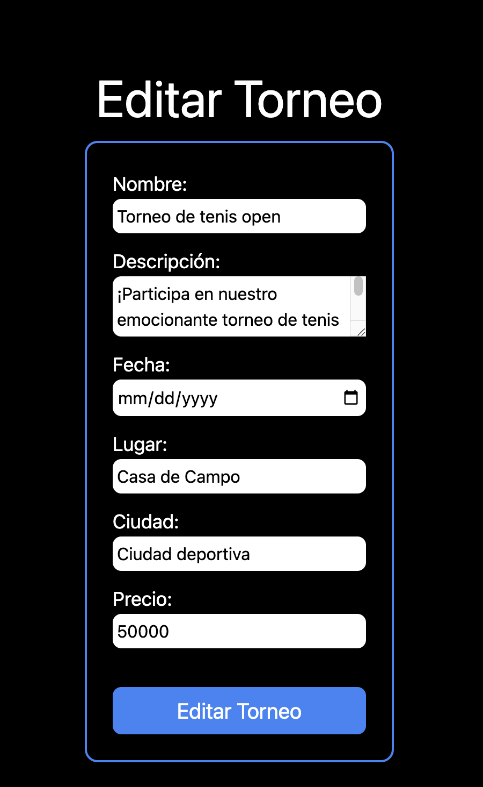

# Liga de Tenis NJS - Una aplicación para ver y participar en torneos de Tenis 🎾

Este proyecto fue desarrollado utilizando Next.JS v14 junto con TailwindCSS para el desarrollo frontend. Se utilizó Node junto con Express y MongoDB para la base de datos junto con Mongoose. Finalmente, El frontend está desplegado en Vercel y el backend en Render

## Caracteristicas del proyecto:

- Es una aplicación que permite crear torneos de Tenis.
- Permite editar la información del torneo o eliminarlo.
- Los usuarios pueden inscribirse a cualquier torneo disponible

## Comenzar 🚀

Estas instrucciones te permitirán obtener una copia del proyecto en tu local, para desarrollo o testing. 

### Instalación 🔧

1. Clona los repositorios en tu local: 
```
git clone git@github.com:Camilo-Suarez98/liga-de-tenis.git
```

y el repositorio del backend:

```
git@github.com:Camilo-Suarez98/liga-de-tenis-back.git
```

2. Ahora entra en el directorio del proyecto /liga-de-tenis

```
cd liga-de-tenis
```

También ingresa al directorio del backend /liga-de-tenis-back

```
cd liga-de-tenis-back
```

3. Instala las dependencias:

Asegurate de tener instalado Node.js:

```
sudo apt install nodejs npm
```

4. Corre el siguiente comando en los dos repositorios
```
npm install
```

4. Crea un archivo `.env.local` en la raiz del proyecto (veras un archivo .env.example en el repositorio que funciona como guia para crear tu local).

5. Corre el codigo!

Asegurate de estar en el directorio correcto

```
cd liga-de-tenis
```

Una vez ahí, ejectura el siguiente comando

```
npm run dev
```

Para el backend ejecuta el mismo comando, no olvides tener ambos proyectos ejecutando al mismo tiempo

## Despliegue 📦

Este proyecto ha sido desplegado en Vercel y Render:

### Vercel

1. Crea una cuenta en vercell: [https://vercel.com](https://vercel.com).
2. Conecta tu repositio de Git.
3. Configura el proyecto y las opciones de despliegue.
4. Despliega!

### Render

1. Crea una cuenta en Render: [https://render.com](https://render.com).
2. Crea un nuevo servicio y selecciona "Servicio Web".
3. Configura el proyecto y las opciones de despliegue.
4. Despliega!

## Authors ✒️

- **Camilo Suarez** - _Developer_ - [https://github.com/Camilo-Suarez98](https://github.com/Camilo-Suarez98)

### Aplicación Desplegada 
- https://liga-de-tenis-cyan.vercel.app/

### Funcionamiento de la aplicaión

La aplicación cuenta con un servicio de autenticación de terceros que le permite hacer el registro e inicio de sesión desde su cuenta de Google.

Este es el perfil de un administrador 
```
{
  email: 'camilo.suarez85@gmail.com',
  password: '1234'
}
```

Este es el de un usuario ya registrado
```
{
  email: 'mo@test.com',
  password: '1234'
}
```

1. Este es el inicio de la página



2. Esta es la pagina donde el usuario puede ver los torneos dando click en el boton 'Ver Torneos' de la pagina de inicio, tambien puede dar click en el header boton 'Torneos'.

La aplicaión cuenta con un servicio de autenticación con terceros que permite al usuario hacer el registro e ingreso desde Google.

3. Esta es la páina de Torneos



4. Esta es la pagina de inicio de sesión, en caso de no estar registrado el usuario puede dar click debajo del boton 'Ingresar' que lo redirige a la pagina de registro.



5. Esta es la pagina de registro, al igual que en la de inicio de sesión el usuario puede registrarse mediante su cuenta de Google.



6. Página de administrador

Aqui el administrador puede ver los torneos y usuarios activos en la aplicación.

Además, le permite crear nuevos torneos.



7. Cuando el administrador da click en 'Nuevo Torneo' lo redirige a la siguiente pagina, la cual es un formulario en el cual el completa con los datos.



8. Este es el detalle del torneo.

Solo el administrador tiene la opción de editar o eliminar los torneos.



Los usuarios no cuentan con esos botones como se puede ver en la siguiente imagen.



9. Esta el la página en la cual el administrador edita los torneos, puede cambiar cualquier información acerca de el.

